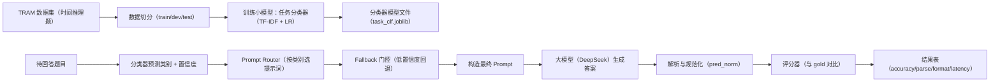
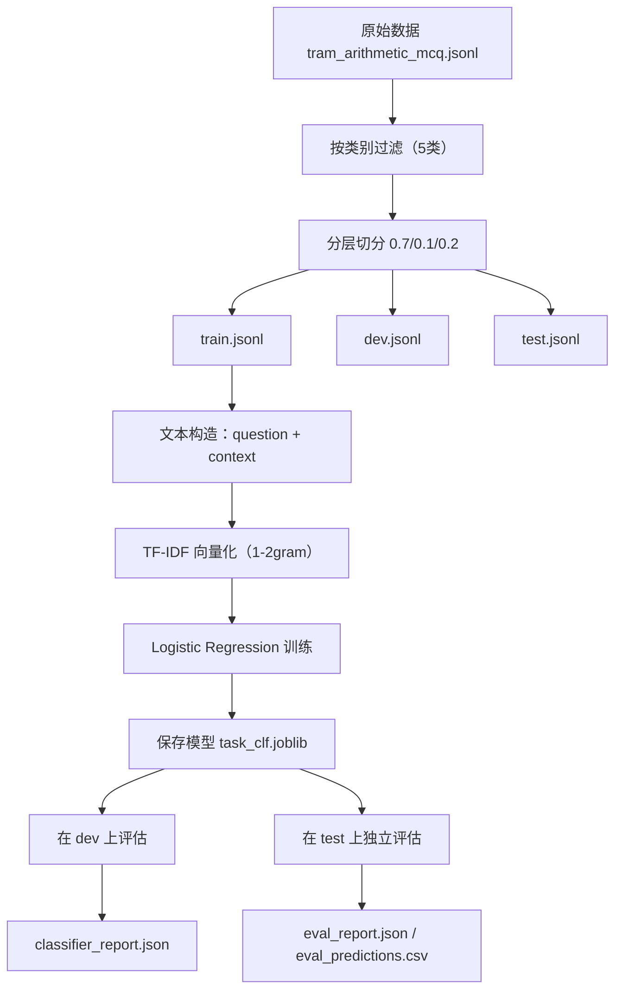
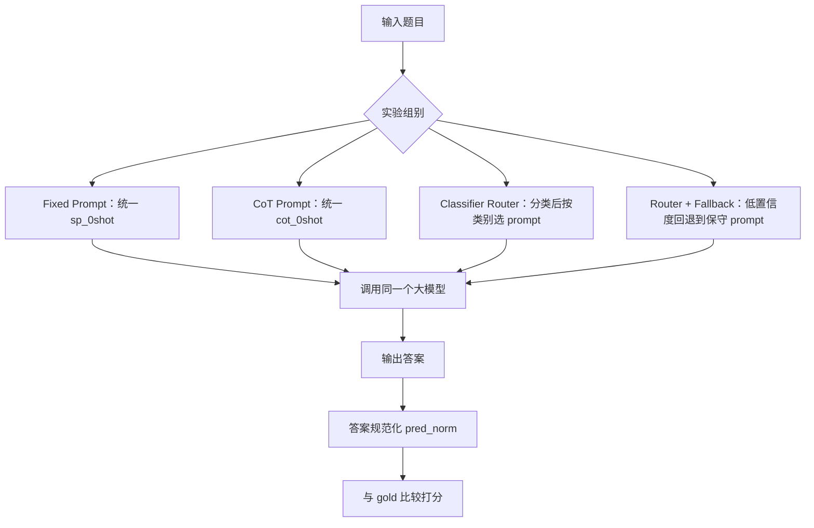
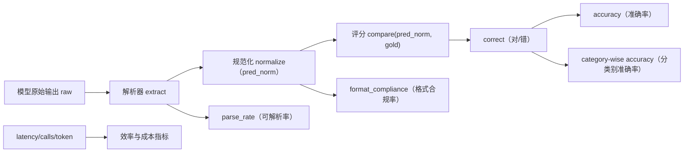

**1) 系统总体架构图**

---

**2) 分类器训练流程图**

---

# 四组方法展示样例

数据来源：

- Fixed Prompt：`outputs/runs/20260325-220652_baseline_fixed_prompt_strict_pvv2.1/predictions.jsonl`
- CoT Prompt：`outputs/runs/20260325-220652_baseline_cot_prompt_strict_pvv2.1/predictions.jsonl`
- Classifier Router：`outputs/runs/20260325-220653_classifier_prompt_router_strict_pvv2.1/predictions.jsonl`
- Classifier Router + Fallback：`outputs/runs/20260325-220653_classifier_prompt_router_strict_fallback_pvv2.1/predictions.jsonl`

说明：

- Fixed Prompt 使用 `sp_0shot`
- CoT Prompt 使用 `cot_0shot`
- Classifier Router：先分类，再按类别从 `prompt_bank.yaml` 选择提示词
- Router + Fallback：当分类置信度低于阈值 `0.95` 时，回退到保守提示词（`sp_0shot`）

---

## 样例 1：Month Shift（展示 fallback 触发）

- 样本ID：`row_4553_ebe70edc8235`
- 问题：`Which month was 1 month before March?`
- 标准答案：`February`

| 方法              | 模板      | 分类置信度 | 是否回退 | 预测     | 正确 |
| ----------------- | --------- | ---------: | -------: | -------- | ---: |
| Fixed Prompt      | sp_0shot  |          - |        - | 2025-02  |   ❌ |
| CoT Prompt        | cot_0shot |          - |        - | February |   ✅ |
| Classifier Router | cot_0shot |     0.8163 |       否 | February |   ✅ |
| Router + Fallback | sp_0shot  |     0.8163 |       是 | 2025-02  |   ❌ |

展示点：这题置信度低，因此触发 fallback，切回保守提示词。

---

## 样例 2：Date Computation（四组都正确）

- 样本ID：`row_7324_181cf5b54706`
- 问题：`If you subtract 27 days to the date 12-29-1393, what will be the new date?`
- 标准答案：`12-02-1393`

| 方法              | 模板      | 分类置信度 | 是否回退 | 预测       | 正确 |
| ----------------- | --------- | ---------: | -------: | ---------- | ---: |
| Fixed Prompt      | sp_0shot  |          - |        - | 1393-12-02 |   ✅ |
| CoT Prompt        | cot_0shot |          - |        - | 1393-12-02 |   ✅ |
| Classifier Router | cot_0shot |     0.9942 |       否 | 1393-12-02 |   ✅ |
| Router + Fallback | cot_0shot |     0.9942 |       否 | 1393-12-02 |   ✅ |

展示点：分类高置信时，router 直接按类别提示词执行，结果稳定。

---

## 样例 3：Time Zone Conversion（当前共同瓶颈）

- 样本ID：`row_12276_2a8832957680`
- 问题：`If it's 7 AM on August 1, 1670 in Asia/Tokyo, what's the date and time in Asia/Kolkata?`
- 标准答案：`3AMonAugust1,1670`

| 方法              | 模板      | 分类置信度 | 是否回退 | 预测（归一化） | 正确 |
| ----------------- | --------- | ---------: | -------: | -------------- | ---: |
| Fixed Prompt      | sp_0shot  |          - |        - | 03:30          |   ❌ |
| CoT Prompt        | cot_0shot |          - |        - | 03:30          |   ❌ |
| Classifier Router | cot_0shot |     0.9709 |       否 | 03:30          |   ❌ |
| Router + Fallback | cot_0shot |     0.9709 |       否 | 03:30          |   ❌ |

展示点：TZ 这个类别四组都错，说明这是当前系统共同难点，不是单一路由的问题。

---

## 样例 4：Hour Adjustment（展示组间差异）

- 样本ID：`row_1260_750bfb23cbd7`
- 问题：`What is 05:56 - 19:18?`
- 标准答案：`10:38`

| 方法              | 模板      | 分类置信度 | 是否回退 | 预测  | 正确 |
| ----------------- | --------- | ---------: | -------: | ----- | ---: |
| Fixed Prompt      | sp_0shot  |          - |        - | 10:38 |   ✅ |
| CoT Prompt        | cot_0shot |          - |        - | 10:38 |   ✅ |
| Classifier Router | sp_0shot  |     0.9673 |       否 | 10:40 |   ❌ |
| Router + Fallback | sp_0shot  |     0.9673 |       否 | 10:38 |   ✅ |

展示点：这题能体现四组差异，适合现场讲“为什么不能只看单题，而要看整体指标”。

**3) 在线推理（四组方法）流程图**

---

### 结果总表（修正前 vs 修正后）

| 方法              | 原准确率 | 修正后准确率 | 提升    |
| ----------------- | -------- | ------------ | ------- |
| Fixed Prompt      | 0.6300   | **0.7125**   | +0.0825 |
| CoT Prompt        | 0.6200   | **0.7075**   | +0.0875 |
| Classifier Router | 0.6075   | **0.7075**   | +0.1000 |
| Router + Fallback | 0.6250   | **0.7125**   | +0.0875 |

**4) 评测指标计算流程图**

---
