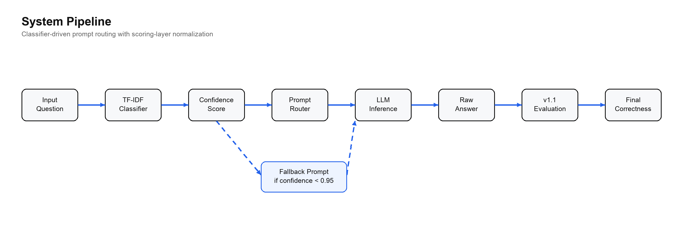
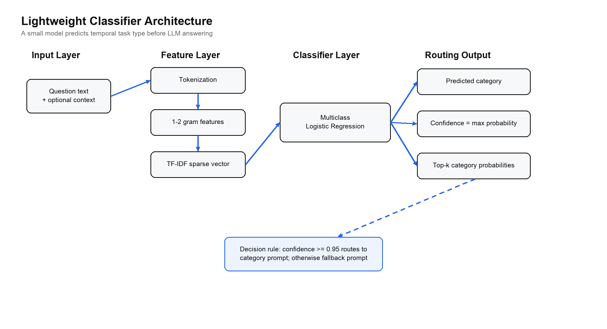
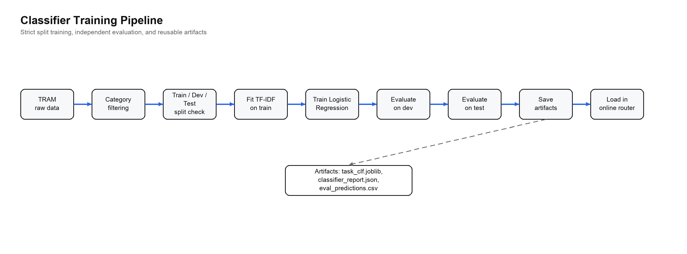
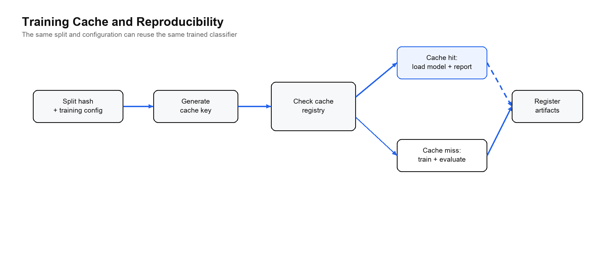
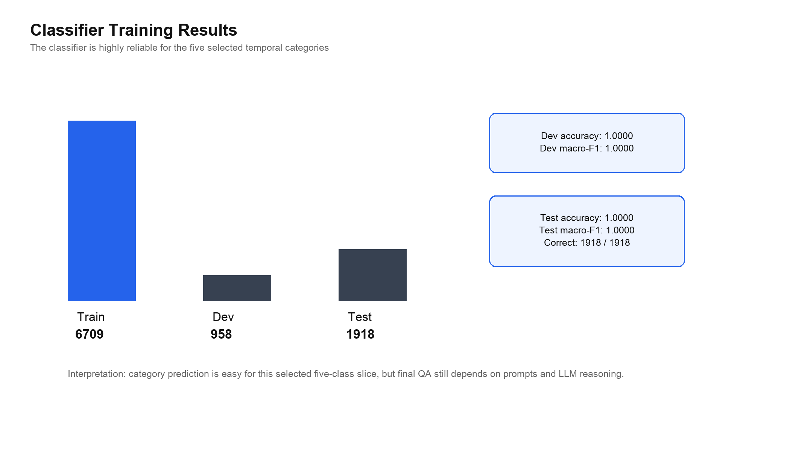
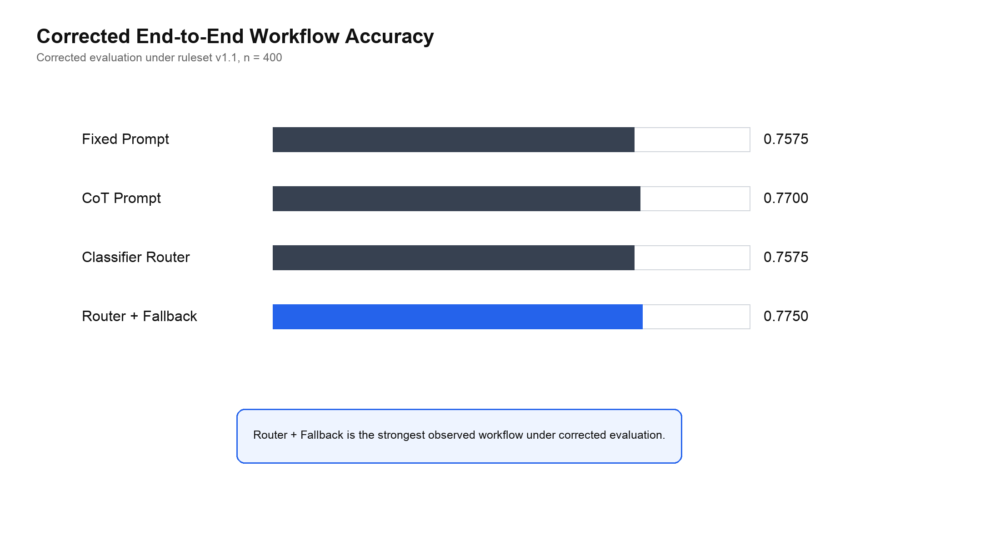
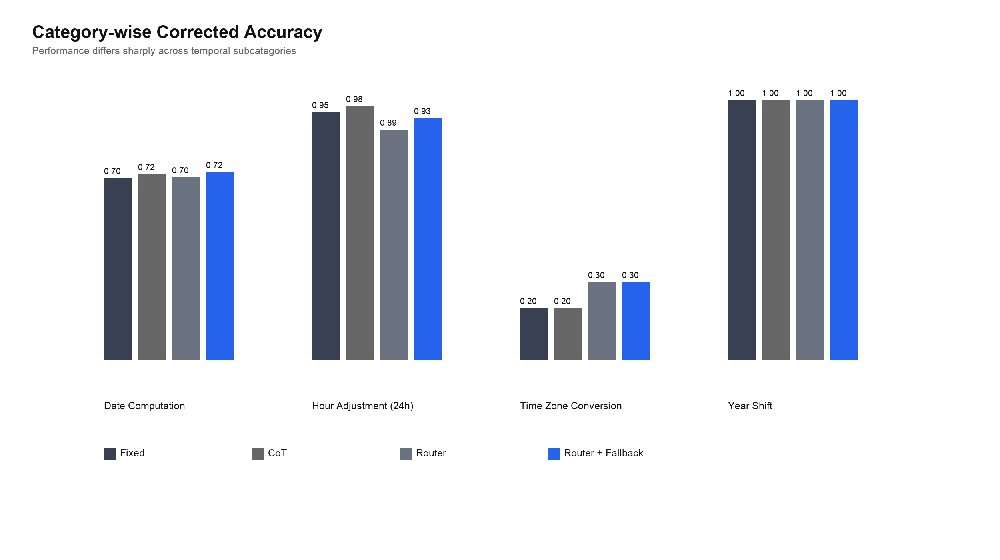
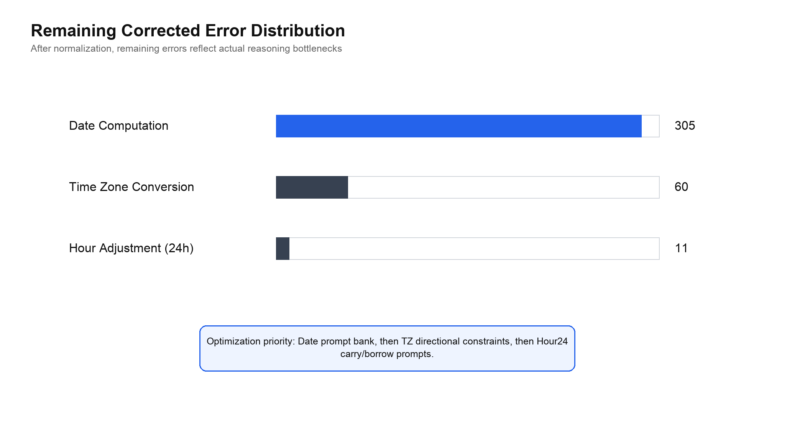

# Abstract {.unnumbered}

Temporal reasoning is a core capability for practical language understanding. Tasks such as date computation, hour adjustment, time-zone conversion, and year shifting require a model to interpret language while also performing stable symbolic computation. A single fixed prompt is often too coarse for such heterogeneous temporal subcategories. This thesis studies a classifier-driven prompt routing framework for complex temporal question answering on a TRAM-derived evaluation setting. The proposed system first uses a lightweight task classifier to predict the temporal category of an input question. It then selects a category-specific prompt for large language model inference. If the classifier confidence is lower than a fixed threshold, the system falls back to a conservative general prompt.

The lightweight classifier is trained with TF-IDF features and multinomial Logistic Regression. It uses a strict train/dev/test split with 6709 training samples, 958 development samples, and 1918 test samples across five temporal categories. The classifier reaches 1.0000 accuracy and 1.0000 macro-F1 on both the development and independent test splits, showing that the selected categories are highly separable at the text-classification level. However, this does not imply that the final question-answering task is solved, because the final answer still depends on prompt quality and LLM temporal reasoning.

The thesis also freezes a corrected evaluation protocol, ruleset v1.1, which normalizes equivalent answer formats only at the scoring layer without changing the original data. Under corrected evaluation, Fixed Prompt, CoT Prompt, Classifier Router, and Classifier Router + Fallback achieve accuracies of 0.7575, 0.7700, 0.7575, and 0.7750 respectively. Router + Fallback is therefore the strongest observed workflow in the current experiment while keeping one LLM call per query. Error analysis shows that the remaining 376 corrected errors are concentrated in Date Computation, Time Zone Conversion, and Hour Adjustment (24h), which provides a concrete direction for future prompt-bank improvement.

**Keywords:** temporal reasoning; TRAM; prompt routing; lightweight classifier; TF-IDF; Logistic Regression; fallback; evaluation normalization

# Introduction

Temporal reasoning is not a single uniform skill. A system may correctly shift a year while still failing at time-zone conversion, or it may handle a 24-hour addition task while making mistakes in date arithmetic across month boundaries. This heterogeneity matters for large language model based question answering because a single prompt may not provide the right reasoning structure for all temporal subcategories.

This thesis focuses on the following research question: can a lightweight classifier improve LLM-based temporal question answering by predicting the task type and routing each question to a more suitable prompt? The design is intentionally conservative. The large language model itself is not fine-tuned. Instead, a small and auditable classifier is placed before the LLM. The classifier predicts the temporal category and a confidence value. The prompt router then chooses either a category-specific prompt or, when confidence is low, a fallback prompt.

The main contribution of this thesis is not a new neural architecture. It is an engineering and evaluation framework that makes the routing process explicit, reproducible, and measurable. The work contributes three concrete elements. First, it implements a TF-IDF plus Logistic Regression classifier for temporal task recognition. Second, it integrates classifier output into a prompt routing and fallback workflow. Third, it distinguishes model behavior from scoring artifacts by using a corrected evaluation protocol, ruleset v1.1, which normalizes equivalent answer formats only during evaluation.

The final results show that the Router + Fallback workflow reaches 0.7750 corrected accuracy, slightly higher than CoT Prompt at 0.7700 and Fixed Prompt at 0.7575. The improvement is modest, but it is meaningful because the workflow does not increase the number of LLM calls. The stronger result is also accompanied by a clearer error surface: after scoring normalization, most remaining errors are real temporal reasoning failures rather than answer-format mismatches.

# Related Work

Temporal reasoning benchmarks have evolved from narrow task datasets toward broader evaluations of time-aware reasoning. Earlier datasets such as TORQUE, TimeDial, and TimeQA focus on specific temporal phenomena, including event ordering, temporal commonsense, and time-sensitive question answering. TRAM expands this line by collecting multiple temporal reasoning tasks under one benchmark. TimeBench further emphasizes that different temporal categories expose different weaknesses in large language models. This benchmark structure motivates the central idea of this thesis: if temporal subcategories are heterogeneous, then prompt selection should also be task-aware.

Prompt engineering is another important background. Chain-of-Thought prompting shows that explicit intermediate reasoning can improve arithmetic, symbolic, and commonsense reasoning. Zero-shot-CoT shows that even a simple instruction such as encouraging step-by-step reasoning can change model behavior. These findings suggest that prompt form can substantially affect reasoning quality. This thesis accepts that premise but asks a more targeted question: instead of using one prompt for every sample, can a small classifier select a better prompt according to the temporal category?

The thesis is also related to routing and selective prediction. RouterBench studies how systems can route different inputs to different LLMs. This work routes prompts rather than models, but the underlying motivation is similar: different inputs benefit from different inference strategies. The fallback mechanism is related to selective classification, where uncertain predictions are rejected or handled conservatively. In this project, low classifier confidence triggers a safer prompt rather than a high-risk category-specific prompt.

Finally, calibration is relevant because confidence values should not be overinterpreted. The classifier uses the maximum predicted probability as a confidence score. This is useful as an engineering signal, but it is not a perfect estimate of correctness. The thesis therefore treats confidence as a practical risk proxy and uses fallback as a simple risk-control mechanism.

# Methodology

## Dataset and Strict Split

The project uses a TRAM-derived temporal reasoning dataset and focuses on five selected categories: Date Computation, Hour Adjustment (24h), Month Shift, Time Zone Conversion, and Year Shift. These categories were chosen because they cover different forms of temporal arithmetic and because they support a clear classifier-driven routing experiment.

The data are organized with a strict split. The classifier training set contains 6709 samples, the development set contains 958 samples, and the independent test set contains 1918 samples. The end-to-end LLM workflow comparison uses a frozen 400-sample evaluation slice. This two-level setup keeps classifier training separate from final workflow evaluation while keeping online API cost manageable.

The strict split is important for avoiding data leakage. The classifier is trained on the training split, checked on the development split, and independently evaluated on the test split. The final workflow table is then computed on the frozen evaluation slice. This separation makes it possible to discuss classifier performance and final QA performance as related but distinct measurements.

## System Pipeline

The full system follows a linear pipeline. A user question is first passed to the lightweight classifier. The classifier returns a predicted category and a probability distribution over categories. The system defines confidence as the maximum predicted probability. If confidence is at least 0.95, the router selects the prompt associated with the predicted category. Otherwise, it uses a fallback prompt. The LLM then produces an answer, and the result is scored under ruleset v1.1.

The scoring step is intentionally placed after LLM generation. The corrected rules do not provide information to the model during inference. They only determine whether the generated answer and the gold answer are equivalent under category-specific normalization.

## Lightweight Classifier Architecture

The classifier is deliberately simple. It uses TF-IDF feature extraction followed by multiclass Logistic Regression. The input is the question text plus optional context. TF-IDF converts text into a sparse vector that captures informative unigram and bigram patterns. Logistic Regression then maps that vector to category probabilities.

The implementation uses `TfidfVectorizer(ngram_range=(1, 2), min_df=2, max_features=50000)` and `LogisticRegression(max_iter=1200)`. Under scikit-learn defaults, Logistic Regression uses L2 regularization with `C=1.0`. The model is saved as `task_clf.joblib`, and the training process also writes `classifier_report.json` and evaluation prediction files.

This architecture is appropriate for the project for three reasons. First, it is lightweight and fast to train. Second, it produces interpretable probability outputs, which are needed for fallback. Third, it separates task recognition from answer generation, making the system easier to explain in a thesis and in a defense demonstration.

## Classifier Training Pipeline

Training follows a standard supervised text-classification pipeline. The system first filters the selected categories and verifies the strict split. It fits the TF-IDF vectorizer only on training data, trains Logistic Regression on the transformed training vectors, evaluates on the development set, and finally evaluates the saved model on the independent test split.

A cache mechanism is used for reproducibility. The cache key is determined by the split and training configuration. If the same configuration has already produced a model and report, the system can reuse them instead of retraining. If the cache does not match, it reruns training and evaluation and records the resulting artifacts.

The classifier reaches perfect performance on the selected five-category split. On the development set, accuracy and macro-F1 are both 1.0000. On the independent test set, all 1918 samples are correctly classified, giving test accuracy and macro-F1 of 1.0000.

Table 1 summarizes the classifier training setup and results.

| Item | Value |
|---|---:|
| Training samples | 6709 |
| Development samples | 958 |
| Test samples | 1918 |
| Feature extractor | TF-IDF |
| N-gram range | 1-2 |
| Minimum document frequency | 2 |
| Maximum features | 50000 |
| Classifier | Logistic Regression |
| Maximum iterations | 1200 |
| Development accuracy | 1.0000 |
| Development macro-F1 | 1.0000 |
| Test accuracy | 1.0000 |
| Test macro-F1 | 1.0000 |

This result should be interpreted carefully. It does not mean that the final temporal QA task is solved. It means that the selected categories have strong textual cues and are separable for a small classifier. The final answer may still be wrong if the selected prompt is weak or if the LLM fails at the temporal computation.

## Prompt Routing and Fallback

The router uses the classifier output to choose the prompt. Let `P(y=k | x)` be the predicted probability for category `k` given question `x`. The predicted category is the category with the highest probability. Confidence is defined as `max_k P(y=k | x)`.

The routing policy is simple: if confidence is greater than or equal to `tau = 0.95`, the system uses the category-specific prompt; otherwise, it uses the fallback prompt. The fallback mechanism is applied before the LLM call. Therefore, it does not require a second LLM call and does not increase `calls/query`.

This design controls risk at the routing layer. A wrong category decision can send the question to an inappropriate prompt, which may harm the final answer. Fallback reduces this risk by avoiding aggressive routing when the classifier is uncertain.

## Evaluation Normalization

The project uses two evaluation views. Base evaluation uses strict string matching. Corrected evaluation uses ruleset v1.1, a category-aware normalization layer. The corrected rules normalize equivalent answer formats without changing the original gold labels or model outputs.

Ruleset v1.1 is necessary because temporal answers often have multiple equivalent surface forms. For example, `3:05` and `03:05` should be equivalent in a 24-hour answer. A compact time-zone gold string may also correspond to a standard `HH:MM` output. If the scorer treats these equivalent forms as different, it creates false negatives.

Table 2 summarizes the main normalization rules.

| Category | Normalization principle |
|---|---|
| Date Computation | Normalize date-like formats such as `MM-DD-YYYY`, `M/D/YYYY`, and `YYYY-MM-DD` |
| Hour Adjustment (24h) | Treat `H:MM` and `HH:MM` as equivalent |
| Time Zone Conversion | Convert compact AM/PM time-zone strings to `HH:MM` when possible |
| Month Shift | Normalize month names, abbreviations, and month-level formats |
| Year Shift | Normalize integer year strings |

Corrected evaluation should not be described as model improvement. It is measurement correction. It provides a more faithful estimate of whether the generated answer is semantically equivalent to the gold answer.

# Experiments and Results

## Evaluation Metrics

The main workflow metric is end-to-end accuracy under corrected evaluation. A prediction is correct if the generated answer matches the gold answer after category-specific normalization. The thesis also reports base accuracy, accuracy delta, latency per query, and calls per query.

Classifier performance is measured separately using accuracy and macro-F1. Macro-F1 is important because the categories are imbalanced. For example, Date Computation has many more samples than Month Shift. A classifier could have high accuracy while performing poorly on minority classes; macro-F1 helps detect that issue.

## Main Workflow Results

The final workflow comparison includes four systems: Fixed Prompt, CoT Prompt, Classifier Router, and Classifier Router + Fallback. All workflows use one LLM call per query.

Table 3 reports the corrected main results.

| Workflow | Corrected accuracy | Base accuracy | Delta | Latency (s/query) | Calls/query |
|---|---:|---:|---:|---:|---:|
| Fixed Prompt | 0.7575 | 0.6300 | +0.1275 | 5.3711 | 1.0 |
| CoT Prompt | 0.7700 | 0.6200 | +0.1500 | 5.2518 | 1.0 |
| Classifier Router | 0.7575 | 0.6075 | +0.1500 | 5.2627 | 1.0 |
| Classifier Router + Fallback | 0.7750 | 0.6250 | +0.1500 | 5.3329 | 1.0 |

Router + Fallback is the strongest observed workflow under corrected evaluation. Its advantage over CoT Prompt is small, but it is achieved without increasing the number of LLM calls. This supports the thesis claim that lightweight routing can be competitive with strong fixed-prompt baselines.

The gap between Classifier Router and Router + Fallback is also important. The fallback version improves from 0.7575 to 0.7750. This suggests that confidence-based risk control can repair some routing losses, even when the classifier itself is highly accurate at category prediction.

## Category-wise Results

Overall accuracy hides substantial category-level variation. Table 4 and Figure 7 show corrected accuracy for four representative categories.

| Category | Fixed | CoT | Router | Router + Fallback |
|---|---:|---:|---:|---:|
| Date Computation | 0.7008 | 0.7159 | 0.7045 | 0.7235 |
| Hour Adjustment (24h) | 0.9545 | 0.9773 | 0.8864 | 0.9318 |
| Time Zone Conversion | 0.2000 | 0.2000 | 0.3000 | 0.3000 |
| Year Shift | 1.0000 | 1.0000 | 1.0000 | 1.0000 |

Date Computation remains difficult even after normalization. Router + Fallback reaches 0.7235, which is the best value among the four workflows for this category, but the error rate is still high. Time Zone Conversion is also difficult. Corrected accuracy improves from the base view, but the category remains far below Year Shift and Hour Adjustment. Year Shift is near ceiling and does not meaningfully distinguish workflows.

## Oracle Upper Bound

The project contains an earlier Oracle Prompt Upper Bound value of 0.6325. This value was computed under base evaluation and represents an offline category-best prompt selection. It is not an online deployable policy and should not be compared directly against the corrected main results. A corrected oracle would need to be recomputed before making strong claims about prompt-bank headroom under ruleset v1.1.

# Error Analysis

After ruleset v1.1 normalization, 376 workflow outputs remain incorrect. These are the most important errors because obvious answer-format mismatches have already been filtered out. The remaining errors are concentrated in three categories.

Table 5 summarizes the remaining corrected errors.

| Category | Remaining errors | Representative causes |
|---|---:|---|
| Date Computation | 305 | month/day errors, multi-field date errors |
| Time Zone Conversion | 60 | one-hour offset errors, minute mismatch |
| Hour Adjustment (24h) | 11 | hour and minute carry/borrow errors |
| Total | 376 | remaining reasoning errors after normalization |

The largest error cluster is Date Computation. This means that future work should focus first on date prompt design, especially multi-step date arithmetic, month-length constraints, leap-year handling, and cross-month transitions.

Time Zone Conversion is the second main bottleneck. Many errors are close to the correct answer but shifted by one hour or affected by minute mismatch. This suggests that the model often applies a partial rule but fails in direction, offset, or time normalization.

Hour Adjustment (24h) has fewer remaining errors, but the errors are meaningful because they usually involve carry or borrow across midnight. This category likely needs prompts that explicitly separate minute computation from hour rollover.

# Limitations and Future Work

This thesis has several limitations. First, the classifier performs perfectly on the selected five-category split, but this should not be overclaimed. It shows category separability in the current setting, not general temporal understanding. If additional TRAM categories are included, the classifier may become less trivial and should be re-evaluated.

Second, the final workflow comparison uses a frozen 400-sample evaluation slice rather than the full 1918-sample test split. This is acceptable for an API-cost-constrained undergraduate project, but a larger evaluation would make the conclusions more stable.

Third, ruleset v1.1 is rule-based. It is transparent and auditable, but it may not transfer automatically to other benchmarks or open-ended temporal QA settings. Future work should validate the normalization strategy on additional data.

Fourth, the existing oracle value is a base-evaluation artifact. A corrected oracle should be recomputed before making firm statements about the upper bound of the prompt bank.

Future work should follow the corrected error surface. The first priority is Date Computation, because it accounts for most remaining errors. The second priority is Time Zone Conversion, where directional constraints and UTC-centered reasoning may reduce offset errors. The third priority is Hour Adjustment (24h), where carry/borrow prompts may address the remaining rollover mistakes.

# Conclusion

This thesis presents a classifier-driven prompt routing framework for complex temporal reasoning on TRAM-derived data. The system uses a lightweight TF-IDF plus Logistic Regression classifier to predict temporal task type, then routes the question to a category-specific prompt or a fallback prompt. The classifier is reproducible and highly accurate on the selected five-category split, reaching 1.0000 accuracy and macro-F1 on the independent test set.

The final corrected evaluation shows that Classifier Router + Fallback achieves 0.7750 accuracy, making it the strongest observed workflow in the current experiment. The gain is modest but meaningful because it does not increase LLM calls per query. The work also shows why evaluation normalization matters: a large part of the apparent error under strict matching comes from equivalent answer formats rather than true reasoning failures.

The main conclusion is therefore balanced. A lightweight classifier can provide a useful routing signal, and confidence-based fallback can reduce some routing risk. However, final temporal QA performance is still limited by the prompt bank and by the LLM's ability to perform difficult date and time computations. The corrected error analysis identifies Date Computation, Time Zone Conversion, and Hour Adjustment (24h) as the most important next targets.

# References {.unnumbered}

Wang, Y. and Zhao, Y. (2024). TRAM: Benchmarking Temporal Reasoning for Large Language Models. Findings of the Association for Computational Linguistics: ACL 2024, pp. 6389-6415.

Chu, Z., Chen, J., Chen, Q., Yu, W., Wang, H., Liu, M. and Qin, B. (2024). TIMEBENCH: A Comprehensive Evaluation of Temporal Reasoning Abilities in Large Language Models. Proceedings of ACL 2024.

Ning, Q., Wu, H., Han, R., Peng, N., Gardner, M. and Roth, D. (2020). TORQUE: A Reading Comprehension Dataset of Temporal Ordering Questions. Proceedings of EMNLP 2020.

Qin, L., Gupta, A., Upadhyay, S., He, L., Choi, Y. and Faruqui, M. (2021). TIMEDIAL: Temporal Commonsense Reasoning in Dialog. Proceedings of ACL-IJCNLP 2021.

Chen, W., Wang, X. and Wang, W. Y. (2021). A Dataset for Answering Time-Sensitive Questions. arXiv preprint arXiv:2108.06314.

Wei, J., Wang, X., Schuurmans, D., Bosma, M., Ichter, B., Xia, F., Chi, E., Le, Q. V. and Zhou, D. (2022). Chain-of-Thought Prompting Elicits Reasoning in Large Language Models. Advances in Neural Information Processing Systems.

Kojima, T., Gu, S. S., Reid, M., Matsuo, Y. and Iwasawa, Y. (2022). Large Language Models are Zero-Shot Reasoners. Advances in Neural Information Processing Systems.

Hu, Q. J., Bieker, J., Li, X., Jiang, N., Keigwin, B., Ranganath, G., Keutzer, K. and Upadhyay, S. K. (2024). RouterBench: A Benchmark for Multi-LLM Routing System. arXiv preprint arXiv:2403.12031.

Geifman, Y. and El-Yaniv, R. (2017). Selective Classification for Deep Neural Networks. Advances in Neural Information Processing Systems.

Guo, C., Pleiss, G., Sun, Y. and Weinberger, K. Q. (2017). On Calibration of Modern Neural Networks. Proceedings of the 34th International Conference on Machine Learning.

Manning, C. D., Raghavan, P. and Schutze, H. (2008). Introduction to Information Retrieval. Cambridge University Press.

Fan, R. E., Chang, K. W., Hsieh, C. J., Wang, X. R. and Lin, C. J. (2008). LIBLINEAR: A Library for Large Linear Classification. Journal of Machine Learning Research, 9, pp. 1871-1874.

Wilson, E. B. (1927). Probable Inference, the Law of Succession, and Statistical Inference. Journal of the American Statistical Association, 22(158), pp. 209-212.

McNemar, Q. (1947). Note on the Sampling Error of the Difference Between Correlated Proportions or Percentages. Psychometrika, 12, pp. 153-157.

scikit-learn developers. LogisticRegression, accuracy_score, f1_score and model evaluation documentation. scikit-learn official documentation.

statsmodels developers. mcnemar and proportion_confint documentation. statsmodels official documentation.

# Appendix A. Project Artifacts {.unnumbered}

The thesis uses the following local project artifacts as evidence:

| Artifact | Purpose |
|---|---|
| `data/splits/classifier_router/train.jsonl` | classifier training split |
| `data/splits/classifier_router/dev.jsonl` | classifier development split |
| `data/splits/classifier_router/test.jsonl` | classifier independent test split |
| `outputs/classifier_strict/classifier_report.json` | classifier training report |
| `outputs/classifier_strict_eval/eval_predictions.csv` | classifier test predictions |
| `backend/runtime/analysis_payload_strict.json` | corrected workflow summary and category results |
| `outputs/tables/gold_format_report.csv` | gold format audit |

# Appendix B. Figure List {.unnumbered}

| Figure | Description |
|---|---|
| Figure 1 | System pipeline for classifier-driven prompt routing |
| Figure 2 | Lightweight classifier architecture |
| Figure 3 | Classifier training pipeline |
| Figure 4 | Training cache and reproducibility mechanism |
| Figure 5 | Classifier training and evaluation results |
| Figure 6 | Corrected workflow accuracy |
| Figure 7 | Category-wise corrected accuracy |
| Figure 8 | Remaining corrected error distribution |
