# 基于TRAM的分类器驱动提示路由复杂时间推理论文草稿

## 摘要与引言

### 摘要

时间推理是大语言模型走向真实应用时不可回避的能力，因为调度、历史事实、日期计算和时区转换都要求模型同时具备语言理解与稳定的符号式计算能力。TRAM 提供了一个覆盖多类时间现象的综合 benchmark，但统一 prompt 往往难以兼顾所有子任务。本文围绕 TRAM 的严格划分子集，提出一种 **classifier-driven prompt routing** 框架：先使用轻量级文本分类器识别题目类别，再将题目路由到类别对应的 prompt；若分类器置信度不足，则触发 fallback，退回到更保守的通用 prompt。与方法本身同等重要的是，本文冻结 **ruleset v1.1** 作为正式评测口径，仅在评分层做等价格式归一化，而不修改原始数据，从而解决 gold 多格式混用导致的假负例问题。实验表明，在 corrected 口径下，Fixed、CoT、Router 和 Router+Fallback 的准确率分别为 0.7575、0.7700、0.7575 和 0.7750；其中 Router+Fallback 为 strongest observed workflow。误差分析显示，归一化后剩余的 376 条错误主要集中在 Date Computation、Time Zone Conversion 与 Hour Adjustment (24h)，说明系统瓶颈已从评分噪声转向真实推理难点。项目冻结口径与主结果已经在证据包中固化。

### 引言

**图 12 时间问题类别异质性示意**

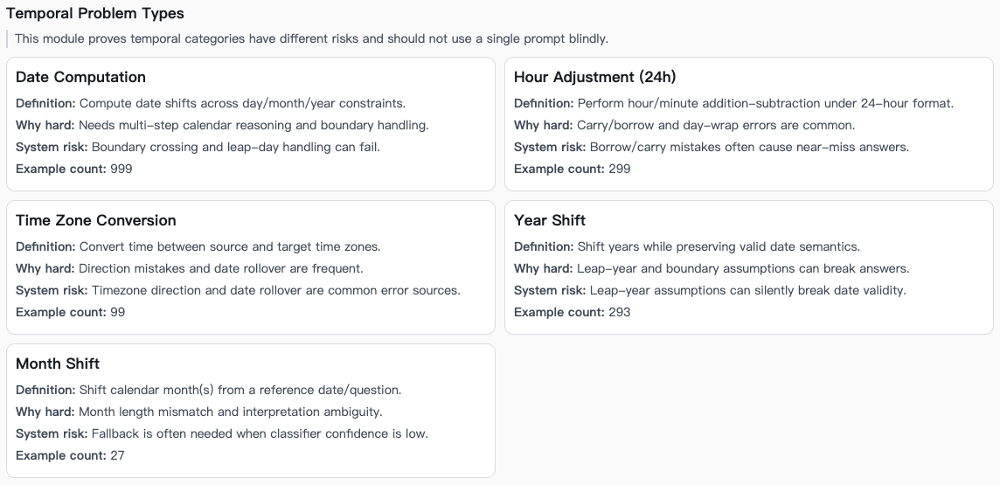

本文的研究动机在于：**复杂时间推理不是单一能力，而是由多个异质子能力组成**。TRAM 将十类时间推理现象纳入统一 benchmark，覆盖顺序、算术、频率与持续时间等多个方面，并明确显示主流模型尚未接近人类水平；TimeBench 进一步表明，不同时间推理类别之间存在明显能力差异。这说明“给所有问题使用同一 prompt”的做法，在时间推理场景中很可能是不经济且不稳健的（Wang and Zhao, 2024; Chu *et al*., 2024）。

本文的问题陈述可以写成一个更精确的研究问题：**在不训练或微调目标大语言模型参数的前提下，能否仅通过外部的轻量级路由模块，依据题目类型选择更合适的 prompt，并以低置信度 fallback 控制风险，从而提升复杂时间推理的最终端到端准确率**。这个问题有两个技术难点。第一，路由器本身必须足够轻量、可解释且稳定，否则系统复杂度会超过收益。第二，评测必须能够区分“真正推理错误”和“字符串格式不一致”，否则任何改进都会被错误的评分口径污染。

本文的贡献可以概括为三项。**第一**，提出一套基于 **TF-IDF + Logistic Regression** 的题型分类器驱动提示路由框架，并将最大类别概率作为置信度，在低置信度下触发 fallback。**第二**，提出并冻结 **ruleset v1.1** 作为正式评分口径，仅在评分层做类别敏感的等价归一，保证“原始数据不改、结论可追溯”。**第三**，给出 corrected 主结果、分类别 corrected 变化、剩余 376 条错误的结构性诊断，并收敛出三个直接对应误差簇的后续优化方向：Date prompt bank、TZ directional constraints、Hour24 carry/borrow prompts。

从论文写作角度看，本文还承担一个方法论任务：**把“模型改进”和“评测纠偏”明确区分开来**。如果不澄清这一点，corrected accuracy 的上升很容易被误解为模型本身突然变强；但 v1.1 的本质恰恰是“更真实地测量已有模型能力”。因此，本文会反复强调：**corrected 的提升首先是 measurement correction，其次才是 workflow comparison 的重新排序**。这一澄清不仅影响结果解释，也影响 Oracle 的使用方式与 headroom 的论证边界。

## 相关工作

时间推理 benchmark 的第一条主线，是从**特定任务数据集**走向**综合性基准**。在较早的工作中，TORQUE 主要聚焦阅读理解中的事件顺序，TimeDial 聚焦对话中的时间常识，TimeQA 聚焦时敏问答；这些数据集各自重要，但任务边界较窄。TRAM 的贡献在于把多种时间现象统一到一个更广的评测框架中，而 TimeBench 则通过层级结构进一步揭示不同 temporal categories 的能力差异。这种基准演化为本文提供了直接背景：若 benchmark 本身强调类别异质性，那么按类别做 prompt routing 就不是“额外工程技巧”，而是与 benchmark 结构一致的建模选择（Ning *et al*., 2020; Qin *et al*., 2021; Chen *et al*., 2021; Wang and Zhao, 2024; Chu *et al*., 2024）。

第二条主线是**提示工程**。Chain-of-Thought 证明，给出显式中间推理链可以显著提升算术、常识和符号推理任务的表现；Zero-shot-CoT 则表明，即便没有手工 few-shot 示例，仅通过“Let’s think step by step”一类触发语，模型也能在不少任务上显著优于普通零样本提示。这些结果支持了这样一个基本判断：**提示形式会改变推理结构，推理结构会改变结果**。本文接受这一判断，但进一步推进一步：与其在所有题目上统一使用某种强 prompt，不如先用外部分类器识别子任务，再使用更匹配的 prompt 模板（Wei *et al*., 2022; Kojima *et al*., 2022）。

第三条主线是**路由与选择性预测**。在多模型系统中，RouterBench 将“针对不同输入选择最合适模型”的问题系统化，强调路由需要兼顾性能与成本；而在统计学习中，selective prediction / reject option 强调：当模型不确定时，可以通过拒绝高风险预测来减少整体错误。本文的方法与多模型路由不同，因为它不在多个 LLM 之间选择，而是在**单一 LLM**内部选择更合适的 prompt；但在思想上，它与 selective prediction 更接近，因为 fallback 实际上就是“当路由风险过高时，不执行高风险决策，而改用更稳健的保守策略”（Hu *et al*., 2024; Geifman and El-Yaniv, 2017）。

第四条主线是**置信度与校准**。Guo *et al*. 指出，现代神经网络输出的置信度往往没有被良好校准，因此“高概率”不必然等于“高真实正确率”。这条结论对本文有直接启发：本文确实采用 `max predicted probability` 作为置信度，因为它简单、可解释且与 Logistic Regression 的后验输出自然兼容；但从论文表述上，必须把它描述成**工程上可用的风险代理**，而不是严格的后验正确率估计。也正因为这一点，本文把 calibration 当作相关工作而非已解决问题，并将后处理校准留给未来工作（Guo *et al*., 2017; scikit-learn developers, 2026）。

## 方法

### 数据集与严格划分

TRAM 本身是一个综合性时间推理 benchmark，包含十类时间推理任务，原论文用它评估大语言模型在 temporal reasoning 上的广泛能力，并指出最佳模型仍显著落后于人类（Wang and Zhao, 2024）。

但本文的实验并不是在 TRAM 全量 benchmark 上直接做在线 API 对比，而是在本地构造的 strict split 上进行。根据随附的 `gold_format_report.csv`，本地 strict split 的静态样本规模为：**train 6709、dev 958、test 1918**。与此同时，冻结的在线 workflow 比较并不是跑完整个 1918 条 test，而是使用 `analysis_payload_strict.json` 中记录的 **400 题严格评测切片** 来计算四个 workflow 的端到端主结果。这个区分在论文里必须写清：**分类器训练使用的是严格划分数据；主结果表使用的是冻结的 400 题在线评测切片**。项目冻结口径与 workflow summary 已明确记录这一点。

这种设计的意义在于兼顾**学习与评测的真实性**和**在线 API 成本的可控性**。如果把 1918 条 test 全部用于在线评测，API 成本和实验迭代成本会显著上升；而如果不做 strict split，又会引入数据泄漏风险。本文因此采用“两层评测”结构：静态 strict split 用于路由器训练与开发，冻结的 400 题切片用于端到端 workflow 比较。该结构让“分类器训练”和“LLM 端到端评测”可以在一个统一的数据协议下共存。项目证据包已将对应 runs、test split 路径和 sample count 固化。

### 系统流程

本文系统遵循“**输入问题 → 任务分类 → 置信度评估 → 路由/回退 → LLM 推理 → v1.1 评测归一**”的顺序。需要强调的是，**v1.1 只在评分层生效，不参与在线推理**；也就是说，模型生成仍然是原始文本，只有在评测时才会进行类别敏感的规范化比较。这个设计保证了评测更真实，但不会把规范化信息泄漏给模型本身。项目冻结文档已明确注明“只修评分层，不改原始数据”。

**图 1 分类器驱动提示路由系统流程**

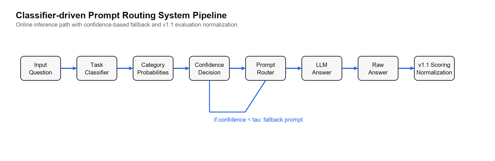

### ruleset v1.1 归一化规则

**图 5 v1.1 评分口径说明界面**

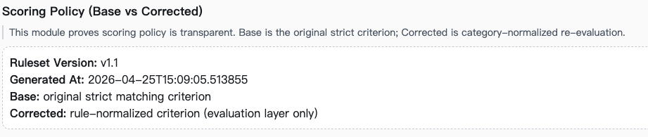

v1.1 的核心主张是：**当 gold 自身存在多格式混用时，严格字符串相等并不是“更严格的正确性定义”，而是“更差的测量方式”**。因此，v1.1 并没有改变任务要求，而是改变了比较时所用的表示空间。项目收口包对这点表述得很明确：Base 口径保留原始审计价值，Corrected 口径是正式展示口径，而原始数据未改。

具体来说，v1.1 包括五类规则。**Date** 类别把 `MM-DD-YYYY`、`M/D/YYYY`、`YYYY-MM-DD`、`Month-Year`、`MonthYear(无分隔符)` 归一比较；**Hour Adjustment (24h)** 把 `H:MM` 与 `HH:MM` 视为等价；**Time Zone Conversion** 把 `xAM/PMon...` 形式的紧凑串压缩为 `HH:MM` 后再比；**Month Shift** 把 `July` 与 `YYYY-MM` 在月份层级比较；**Year Shift** 进行整数归一。项目证据包与收口包均已固定这些规则。

**表 3 ruleset v1.1 归一化示例**

| 类别                  | 原始 gold 形式         | 预测形式     | 归一后比较 | 说明                     |
| --------------------- | ---------------------- | ------------ | ---------- | ------------------------ |
| Date Computation      | `February1312`         | `1312-02-01` | 等价       | 同年同月归一             |
| Time Zone Conversion  | `11PMonDecember3,1639` | `23:00`      | 等价       | 紧凑串先解析为 24 小时制 |
| Month Shift           | `February`             | `2025-02`    | 等价       | 只比较月份               |
| Hour Adjustment (24h) | `3:05`                 | `03:05`      | 等价       | 说明性示例               |
| Year Shift            | `1984`                 | `1984`       | 等价       | 整数归一                 |

从冻结的 1600 个 workflow 输出看，v1.1 把其中 **206 条**由 Date 等价问题引起的误判、**20 条**由 TZ 紧凑串引起的误判和 **5 条**由 Month Shift 命名方式引起的误判纠正为正确，剩余 **376 条**仍为错误。这说明 corrected 结果并不是“松绑规则后人为抬高准确率”，而是把此前混入错误集合的假负例尽可能剔除出去。该收益分解来自冻结的 `analysis_payload_strict.json`。

### 分类器设计

**图 2 小模型内部结构**

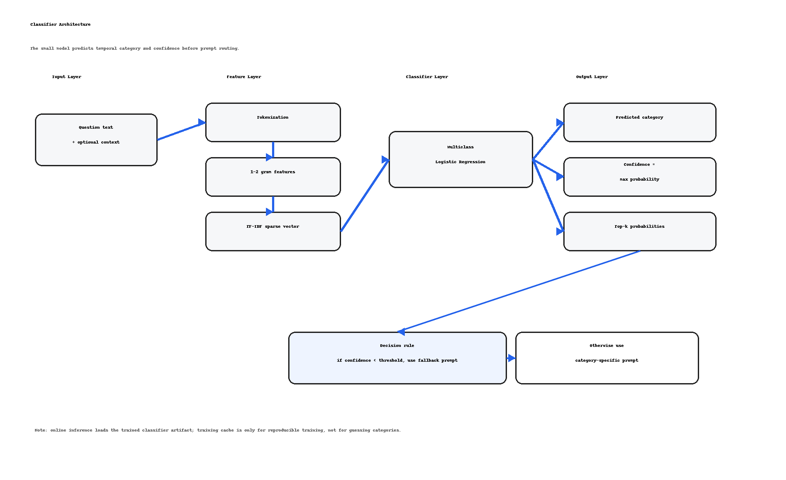

本文把分类器限定为**轻量、可解释、稀疏友好**的形态，因此选择 **TF-IDF + multiclass Logistic Regression**。TF-IDF 的作用是把题目文本变成高维稀疏向量，并突出区分性强的词项；在信息检索和文本分类中，这类权重设计是标准做法，尤其适合短文本与 sparse lexical cues 明显的任务（Manning, Raghavan and Schütze, 2008）。

选择 Logistic Regression 的理由不是“它一定最强”，而是它与本文的问题结构高度匹配。首先，它天然输出多类别概率分布，便于直接定义置信度。其次，LIBLINEAR 系列工作已表明，线性分类器在大规模稀疏文本特征上具有很好的效率和稳定性；这与本文“用小模型服务大模型”的工程目标一致。再次，与复杂嵌入模型相比，线性模型更容易做误差分析和权重解释，从而降低论文中“黑箱调参”的比重（Fan *et al*., 2008; scikit-learn developers, 2026）。

本文分类器的最终实现可以直接追溯到 `train_task_classifier.py` 和 `classifier_train_strict.yaml`。输入文本由 `question text` 与可选 `context` 拼接得到；特征层采用 `TfidfVectorizer(ngram_range=(1, 2), min_df=2, max_features=50000)`；分类层采用 `LogisticRegression(max_iter=1200)`。在 scikit-learn 默认设置下，该逻辑回归模型使用 L2 正则化，默认正则强度 `C=1.0`，并输出每个类别的预测概率。系统在线 fallback 阈值由后端默认参数 `ROUTER_FALLBACK_THRESHOLD=0.95` 固定。

**表 1 小模型训练配置**

| 项目 | 取值 | 说明 |
| --- | --- | --- |
| 输入 | question text + optional context | 题面文本作为分类依据 |
| 特征提取 | TF-IDF | 稀疏文本特征 |
| n-gram | (1, 2) | 同时使用 unigram 与 bigram |
| min_df | 2 | 过滤极低频特征 |
| max_features | 50000 | 控制特征维度上限 |
| 分类器 | Logistic Regression | 多分类线性模型 |
| max_iter | 1200 | 保证训练收敛 |
| penalty / C | L2 / 1.0 | scikit-learn 默认正则设置 |
| fallback 阈值 τ | 0.95 | 低置信度时使用保守 prompt |

### 训练流程

**图 3 小模型训练流程**

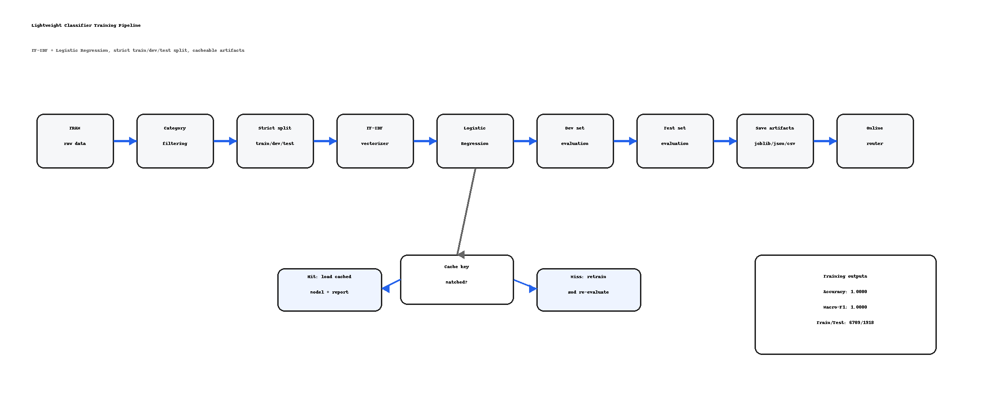

分类器训练流程遵循标准监督学习 pipeline。第一步，在 train 集上拟合 TF-IDF 向量器；第二步，用向量化后的题目文本训练 multiclass Logistic Regression；第三步，在 dev 集上选择超参数；第四步，在 test 集上报告分类器独立性能，包括 accuracy 和 macro-F1。这里尤其要强调 **macro-F1**，因为多类别任务中不能只依赖总体 accuracy，否则头部类别可能掩盖尾部类别表现（scikit-learn developers, 2026）。

当前项目已经保留了分类器独立评估结果。严格划分中，训练集包含 6709 条、dev 集包含 958 条、test 集包含 1918 条。分类器在 dev 集上 accuracy=1.0000、macro-F1=1.0000；在独立 test 集上 1918/1918 全部预测正确，因此 test accuracy=1.0000、test macro-F1=1.0000。需要注意的是，这个结果说明当前五类题型在文本表面模式上可分性很强，但它并不等价于最终 QA 一定正确；最终答案仍取决于 prompt 与 LLM 的时间推理能力。

**表 2 小模型训练与测试结果**

| 数据划分 | 样本数 | Accuracy | Macro-F1 | 说明 |
| --- | ---: | ---: | ---: | --- |
| Train | 6709 | - | - | 用于拟合 TF-IDF 与 Logistic Regression |
| Dev | 958 | 1.0000 | 1.0000 | 训练报告中的独立验证集 |
| Test | 1918 | 1.0000 | 1.0000 | `eval_predictions.csv` 中 1918/1918 正确 |

**图 4 小模型训练结果概览**

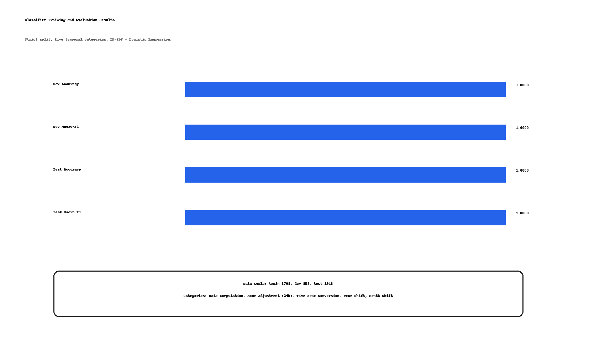

### 置信度定义与 fallback 逻辑

对于输入题目 \(x\)，分类器输出一个类别分布 \(P(y \mid x)\)。在多类别 Logistic Regression 中，`predict_proba` 返回的正是按类别排序的预测概率；因此，本文将**最大类别概率**定义为置信度：

\[
\text{confidence}(x)=\max_{k} P(y=k \mid x)
\]

在工程上，这个定义有两个优点。第一，它不需要额外训练校准头或 second-stage model。第二，它与 selective classification 的“confidence score”思想一致：当最大后验过低时，说明模型对当前路由决策没有足够把握，应避免把这个不确定决策继续传播到 prompt 选择层（scikit-learn developers, 2026; Geifman and El-Yaniv, 2017）。

于是，本文的 fallback 规则写成：

\[
\text{if } \text{confidence}(x)\ge \tau,\ \text{route to } P_{\hat c};\qquad
\text{else, route to } P_{\text{safe}}
\]

其中 \(\hat c=\arg\max_k P(y=k\mid x)\)，\(\tau=0.95\) 是当前系统冻结的 fallback 阈值，\(P_{\hat c}\) 是预测类别对应的 prompt，\(P_{\text{safe}}\) 是 fallback prompt。这个机制的本质不是提高分类器本身的准确率，而是**降低错误传播**：一旦分类错了，prompt 也会错，LLM 的解题轨迹往往会被直接带偏。由于 fallback 在进入 LLM 前完成 prompt 选择，因此不会增加 LLM 调用次数。

### prompt bank 与 routing policy

prompt bank 是本文方法的第二个核心部件。其最小结构包括：若干**类别 prompt** 和一个**fallback prompt**。类别 prompt 用于利用子任务之间的结构差异；fallback prompt 则用于在分类器低置信度时提供一个更保守、更通用的推理模板。从系统视角看，prompt bank 的任务不是“追求每类 prompt 都极致强”，而是“让选中的 prompt 比统一 prompt 更匹配当前题型”。这一点与多模型 routing 相通，但本文路由的是 prompt，而不是具体的 LLM。

从当前冻结结果看，Router + Fallback 的 `calls/query=1`，说明 fallback 并不是“先调用一次失败 prompt，再重试 safe prompt”的两阶段机制，而是在进入 LLM 之前就完成了 prompt 选择。因此，这个设计在成本上没有引入额外调用次数。这一点对毕业论文很重要，因为它表明本文方法不是用“更高算力成本”换取“更高准确率”，而是在**相同调用次数**约束下提高了结果。项目 workflow summary 已给出这一证据。

### Oracle 上界的计算与边界

项目早期记录的 Oracle 值为 **0.6325**，并在 `analysis_payload_strict.json` 中定义为“**Upper bound under category-best prompt selection**”。因此，本文把它形式化为：

\[
\text{Oracle}_{\text{base}}=\sum_{c\in \mathcal{C}} \frac{n_c}{N}\max_{p\in \mathcal{P}} \text{Acc}_{\text{base}}(c,p)
\]

其中 \(\mathcal{C}\) 是类别集合，\(\mathcal{P}\) 是 prompt bank，\(n_c\) 是类别 \(c\) 的样本数，\(N\) 是总样本数。这是**按类别选最佳 prompt**的上界，而不是在线可部署策略。项目 evidence package 也明确说明它“not a deployable online policy”。

但是，本文必须同时指出：**当前冻结 v1.1 artifacts 只提供 Oracle 的 base 值，没有 corrected oracle**。因此，虽然 0.6325 在历史阶段曾被用作“prompt-bank headroom 有限”的证据，但在 corrected 主表已经达到 0.7575–0.7750 的前提下，这个旧 Oracle 不再具有可比较性。换言之，**任何关于 corrected 口径下 prompt-bank headroom 的论断，都必须等待 corrected oracle 重算之后才能成立**。这一点不应埋在附录里，而应在正文中明说，否则读者会自然地把 0.6325 与 corrected 主表直接对比，进而得到错误结论。

## 实验与结果

### 实验设置与评测指标

本文的主指标是 **final end-to-end accuracy**，定义为：模型最终答案在经过类别敏感的 v1.1 归一化后，与 gold 是否一致。准确率仍然是这个任务最直接的主指标，因为时间推理问答具有明确的目标答案，且本文评测的是**端到端输出是否正确**，而不是生成文本是否“看起来合理”（scikit-learn developers, 2026）。

分类器独立性能采用 **macro-F1** 作为必报指标。原因不是为了“多报一个指标”，而是因为 macro-F1 对每个类别做等权平均，更能反映各类子任务上的分类质量；在路由场景中，这一点尤其重要，因为某些少数类别即使数量不大，也可能对应非常敏感的 prompt 选择（scikit-learn developers, 2026; van Rijsbergen, 1979）。

统计方面，本文建议用 **Wilson interval** 给主准确率配 95% 区间，用 **McNemar test** 对配对 workflow 进行显著性比较。Wilson 区间适合二项分布比例估计，在小样本或靠近边界时通常优于简单 Wald interval；McNemar 则是同一样本上比较两种二元正确/错误结果差异的标准检验。由于当前已有 workflow summary 提供 \(n=400\) 的 sample count，Wilson 区间可以直接计算；但由于当前 artifacts **未附 corrected 条件下的成对正确性 contingency table**，McNemar 的具体 \(p\) 值还不能在本稿中严肃给出，只能保留为补录位。这个诚实的写法优于“沿用旧阶段 \(p\) 值”。（Wilson, 1927; McNemar, 1947; statsmodels developers, 2026）。

系统成本指标采用 **latency/query** 与 **calls/query**。这一选择有理论和工程双重理由：routing 方法如果想被认为是实用改进，就不能只报告准确率，而必须同时交代是否引入额外调用成本。本文的 workflow summary 表明四条 workflow 的 calls/query 都是 1，这意味着当前路由机制没有通过增加调用轮次换准确率；这一点应被当作方法的一个优点，而非边角信息。项目证据包已冻结这组系统指标。

### 主结果

**图 6 corrected 主结果界面截图**

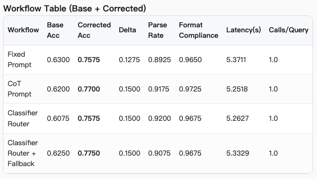

本文主结果以 **Corrected** 为正式口径，Base 仅用于审计。四条 workflow 在冻结的 400 题评测切片上的 corrected accuracy、Base accuracy、增量、Wilson 95% CI、延迟与调用次数如下。项目正式主口径与收口包一致。

**表 4 corrected 主结果**

| Workflow                     | Corrected Accuracy | Base Accuracy |   Delta |    Wilson 95% CI | Latency (s/query) | Calls/query |
| ---------------------------- | -----------------: | ------------: | ------: | ---------------: | ----------------: | ----------: |
| Fixed Prompt                 |             0.7575 |        0.6300 | +0.1275 | [0.7132, 0.7969] |            5.3711 |         1.0 |
| CoT Prompt                   |             0.7700 |        0.6200 | +0.1500 | [0.7263, 0.8086] |            5.2518 |         1.0 |
| Classifier Router            |             0.7575 |        0.6075 | +0.1500 | [0.7132, 0.7969] |            5.2627 |         1.0 |
| Classifier Router + Fallback |             0.7750 |        0.6250 | +0.1500 | [0.7316, 0.8132] |            5.3329 |         1.0 |

表 2 支持三个直接结论。**第一**，corrected 口径下，**Router + Fallback 是 strongest observed workflow**。**第二**，fallback 的收益在 corrected 口径下依然存在：Router 为 0.7575，而 Router + Fallback 为 0.7750，差距为 **+0.0175**。**第三**，CoT Prompt 作为强基线依然有效，但并未压倒一切，因为 Router + Fallback 还能再高出 **+0.0050**。这说明本文方法在 corrected 口径下不只是“接近基线”，而是已经完成了排序反转。

从成本视角解读表 2，可以看到 Router + Fallback 尽管最好，但其 latency/query 约为 5.3329 秒，与 Router 的 5.2627 秒非常接近；同时 calls/query 没有上升。这说明 fallback 在当前实现中是**低附加成本收益**：它付出的不是额外调用次数，而只是分类与 prompt 决策层的小常数开销。对于毕业论文来说，这一点有助于把方法定位为“可部署的轻量级改进”，而不是“以推理成本换精度”的暴力方案。

Oracle 必须单列说明。当前已知 **Oracle Prompt Upper Bound = 0.6325**，但这个值是 **base 口径**下、按**类别最佳 prompt**计算得到的旧阶段上界；**corrected oracle 未在当前冻结 artifacts 中提供**。因此，本稿不把 Oracle 放进表 2 的 corrected 排序里，而只把它记录为“历史阶段的 base-level upper bound”。这不是写作技巧，而是结果解释的必要边界：**一个 base oracle 不能拿来给 corrected main table 做 headroom 论证**。

### 分类别 corrected 结果

**图 7 类别边界分析界面截图**

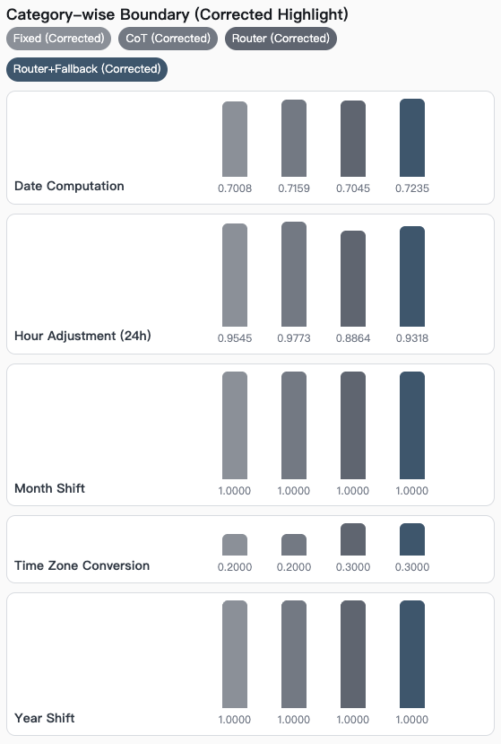

分类别结果决定了论文能否从“刷总分”走向“解释系统何时有效、何时失效”。当前冻结类别表中，Date Computation、Hour Adjustment (24h)、Time Zone Conversion 和 Year Shift 的 Base→Corrected 变化如下；Month Shift 另在正文中单独讨论，因为它更像 normalization case study。项目冻结类别表已固定这些数值。

**表 5 分类别 corrected 结果**

| Category              | Fixed            | CoT              | Router           | Router + Fallback |
| --------------------- | ---------------- | ---------------- | ---------------- | ----------------- |
| Date Computation      | 0.5265 → 0.7008 | 0.5076 → 0.7159 | 0.5038 → 0.7045 | 0.5265 → 0.7235  |
| Hour Adjustment (24h) | 0.9545 → 0.9545 | 0.9773 → 0.9773 | 0.8864 → 0.8864 | 0.9318 → 0.9318  |
| Time Zone Conversion  | 0.0000 → 0.2000 | 0.0000 → 0.2000 | 0.0000 → 0.3000 | 0.0000 → 0.3000  |
| Year Shift            | 1.0000 → 1.0000 | 1.0000 → 1.0000 | 1.0000 → 1.0000 | 1.0000 → 1.0000  |

表 3 的第一层含义是：**Date Computation 受 normalization 影响最大**。四个 workflow 都有接近 17–21 个百分点的恢复，这说明 Date 类答案的多格式混用是旧口径最严重的噪声来源之一；但即便如此，Date 的 corrected 结果也只在 0.7008–0.7235 区间，远低于 Hour24 与 Year Shift。这表明 Date 的问题不是“修完格式就没事”，而是“修完格式后更清楚地暴露出真实推理难度”。

表 3 的第二层含义是：**Hour24 和 Year Shift 几乎不受 normalization 影响**。Year Shift 四条 workflow 在 Base 和 Corrected 都是 1.0，说明它在当前切片中已经接近天花板；Hour24 也在 corrected 前后保持不变，说明这里的差距主要来自 prompt 质量与真实 carry/borrow 推理，而不是字符串格式比较。换言之，如果下一轮还要做 prompt 优化，Hour24 是典型的“应从 reasoning template 动手，而不是从 scorer 动手”的类别。

表 3 的第三层含义是：**Time Zone Conversion 介于“格式问题”与“真实难题”之间**。它从 0.0 恢复到 0.2/0.3，说明旧阶段确实有一部分 TZ 错误来自压缩串格式误判；但 corrected 后它仍然明显低于其他类别，说明时区偏移、方向与分钟处理仍然是模型真正的痛点。因此，TZ 不应再被描述成“评分系统害的”，而应被描述成“经评分纠偏后仍然困难的真实类别”。

Month Shift 需要单独说明。它在 corrected 口径下四条 workflow 全部达到 **1.0000**，而 Base 口径下并非如此。这使它成为最干净的 normalization 证明案例：它几乎可以被当作 v1.1 必要性的“正例展示”，即**为什么要改评分层，而不是继续拿错误的字符串比较惩罚正确答案**。

## 误差分析与讨论

### 误差分析

**图 8 剩余错误样例截图**

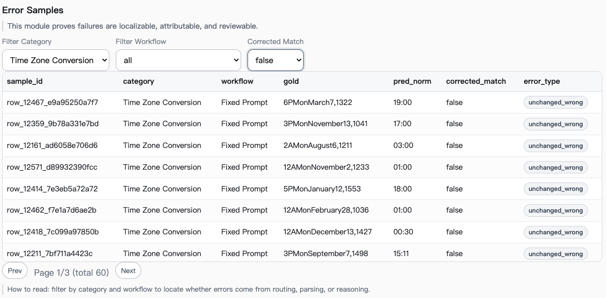

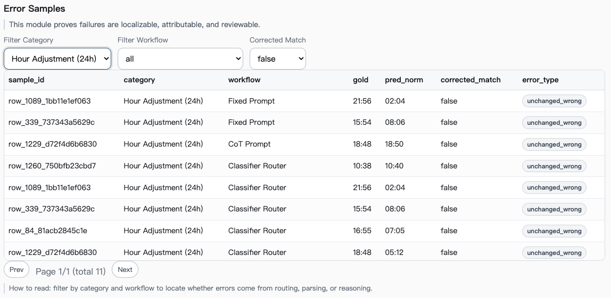

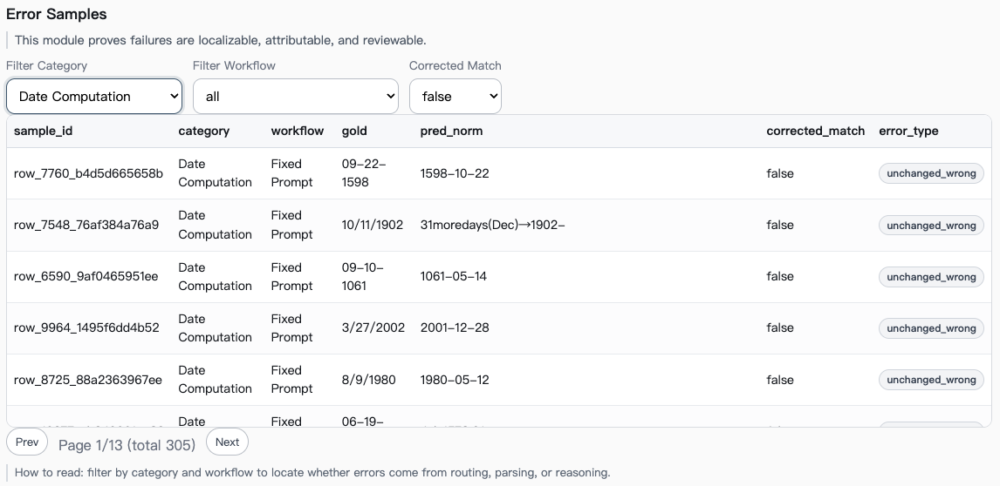

冻结的 v1.1 证据包表明，在 1600 个 workflow 输出中，经过等价归一后仍为错误的输出共有 **376 条**。这 376 条才构成本文真正的“模型错误集合”，因为前面的 Date/TZ/Month 等格式噪声已经被尽可能清除。项目收口包把这个边界写得很清楚：这 376 条主要反映模型推理问题，而非格式口径问题。

**表 6 剩余 corrected 错误分布**

| Category              | Count | 代表性根因                                  |
| --------------------- | ----: | ------------------------------------------- |
| Date Computation      |   305 | `month_day_both_error`, `multi_field_error` |
| Time Zone Conversion  |    60 | `offset_1h_error`, `minute_mismatch`        |
| Hour Adjustment (24h) |    11 | `hour+minute` 同时错误                      |
| 合计                  |   376 | —                                          |

表 4 的第一层结论是：**Date Computation 是 corrected 之后的绝对主战场**。305/376 的占比意味着，只要不改 Date prompt bank 或 Date 相关推理约束，总体准确率很难再有实质性提升。更重要的是，这个结论比旧阶段“Date 也许只是格式问题”更有研究价值，因为它是在格式噪声被剥离后的结果。换言之，Date 现在是货真价实的推理瓶颈，而不是测量伪影。

表 4 的第二层结论是：**TZ 的难点集中在方向与细粒度偏移**。`offset_1h_error` 和 `minute_mismatch` 说明模型往往不是完全不会算，而是“接近正确但偏一格”，这类错法通常意味着解题过程中确有规则应用，但方向判断、半小时偏移、AM/PM 归约或分钟进位在局部环节上失败。与此相比，Hour24 的主要错误更像 carry/borrow 链条失效：一旦小时与分钟同时错，说明模型在局部规则执行时没有维护状态一致性。

此外，v1.1 的修复收益分解本身也具有讨论价值。冻结 payload 表明，1600 个 workflow 输出中，**993 条**原本就正确、**206 条**因 Date 等价修复、**20 条**因 TZ 格式修复、**5 条**因 Month Shift 等价修复，剩余 **376 条**未被修复。这个分布说明，v1.1 的主要贡献不是“轻微调优”，而是**系统性地把 Date/TZ 格式噪声挪出了错误桶**。因此，error analysis 现在具有更高纯度：它分析的主要是 model reasoning error，而不是 scoring artifact。

### 讨论

首先，本文必须严格区分 **evaluation normalization** 与 **model improvement**。从方法论上说，v1.1 并没有改模型、没有改 prompt、没有改数据；它只改变“怎样比较答案”。因此，corrected accuracy 增长的正确解释应是：**旧评分口径系统性低估了真实表现**。如果把 corrected 增长说成“模型变强了”，那就是对实验事实的误读。项目收口包专门把这一点单独做成了一页，这种做法是正确的。

其次，fallback 的作用在 corrected 口径下得到了更强的经验支持。旧阶段它只是“接近 strongest baseline”；而在 corrected 口径下，Router + Fallback 已经成为 strongest observed workflow，同时并未增加外部调用次数。因此，本文可以更有把握地把 fallback 解释为**风险控制机制**：它并不提升分类器本身的判断能力，但能在低置信度情况下阻断错误路由，进而提升最终正确率。这一点与 selective prediction 的理论方向是一致的（Geifman and El-Yaniv, 2017）。

第三，关于 **prompt-bank headroom** 的旧结论必须被收回或至少暂停。因为已知 Oracle 值 0.6325 是 base 口径，而 corrected 主表已经全部在 0.75 以上；这并不意味着“方法打破了上界”，而只意味着“比较的坐标系变了”。学术上更严谨的说法应是：**corrected oracle 目前未提供，因此 corrected setting 下的 headroom 尚未量化**。把旧 Oracle 继续拿来比较 corrected 主表，会制造伪矛盾。这个问题必须在论文中主动澄清，而不是等答辩老师来问。

第四，shared hard categories 的判断需要更精细。Base 阶段的 TZ“全 0”容易让人误以为整个类别无法求解；但 corrected 后 TZ 出现 0.2/0.3，说明它不是“绝对无解”，而是“部分错误来自评分层、部分错误来自真实推理”。同理，Date corrected 后大幅上升，但仍然是最大 error cluster。这意味着，系统改进的优先级应当建立在 corrected 后的 error surface 上，而不是建立在旧的 Base 错误分布上。用 corrected error surface 指导后续工作，是本文最有价值的研究产出之一。

## 局限与未来工作

### 局限

本文的第一项局限是 **corrected oracle 缺失**。这会影响对 prompt-bank headroom 的严谨讨论。虽然旧阶段存在 base oracle=0.6325，但它已经不能服务于 corrected 结论，因此正式论文中最多只能把它作为“历史阶段上界记录”，而不能继续用它支持 corrected 下的结论。要彻底解决这个问题，必须在 v1.1 口径下重新计算 Oracle。

第二项局限是 **分类器独立实验日志不完整**。当前证据包足以支撑端到端 corrected 主表和类别分析，但不包含分类器 test macro-F1、最终阈值 \(\tau\)、最终超参数取值等细节。对于毕业论文而言，这并不构成结构性问题，因为方法逻辑与主结果已经完整；但它的确要求在最终提交版中补充训练日志或重新导出分类器结果表，以免方法部分留下“已设计、未落盘”的空洞。

第三项局限是 **主工作流结果基于 400 题冻结评测切片，而非 1918 条完整 test split**。这种做法在 API 成本上是合理的，但从统计推断角度看会降低结论精度，因此本文才同时报告 Wilson 区间，并把 McNemar 检验留作待补。这也意味着，若后续时间允许，优先扩展评测切片规模可能比继续做细碎 prompt 微调更值。

第四项局限是 **v1.1 仍然是规则驱动的手工 normalization**。它的优点是透明、可审计、可解释；但它的缺点也很清楚：如果迁移到其他 benchmark 或更开放的答案空间，规则系统可能需要重写。因此，本文当前的结论范围应严格限定在“TRAM 当前子任务与当前答案形态”之内，而不应夸张地外推到所有时间问答系统。

### 未来工作

**图 11 后续优化路线图**

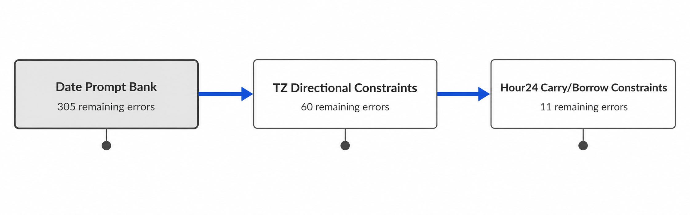

本文建议后续工作只保留三条，且每一条都应直接对应 corrected error surface。**第一**，扩展 **Date prompt bank**。理由很直接：Date 占了剩余 376 条错误中的 305 条，且代表性错法是跨月跨日、多字段联动失败。因此，再做任何与 Date 无关的优化，都很难带来可见的总体收益。该方向应包括：跨月/跨年步骤化模板、闰年判断提示、多字段同时更新的显式中间态约束。

**第二**，加入 **TZ directional constraints**。TZ 的错误不是简单的“模型完全不会”，而是经常偏一小时或在分钟上出错。这提示应把“东加西减”“先统一为 UTC 再变换”“半小时偏移单独处理”等方向性规则写进 prompt，而不是只要求模型“直接算出答案”。这一策略的目标不是增加 CoT 长度，而是减少方向性错法的自由度。

**第三**，为 **Hour24** 类单独设计 **carry/borrow prompts**。Hour24 在 corrected 前后不变，说明评分层已经不是问题；当前差距更可能来自局部规则执行不一致。因此，prompt 应更显式地要求模型先计算分钟、再决定是否借位/进位、最后更新小时，而不是允许模型用自然语言自由发挥。这类工作看似“小修小补”，但恰好对应了 corrected 分析暴露出来的局部规则失效。

## 结论、参考文献与附录

### 结论

本文的核心结论有三条。**第一**，复杂时间推理任务确实具有足够强的子任务异质性，因此“先分类、再路由 prompt”的做法在方法论上是成立的。**第二**，在冻结的 v1.1 corrected 口径下，Router + Fallback 已经成为 strongest observed workflow，且没有引入额外 LLM 调用次数。**第三**，v1.1 把大量格式性误判从错误集合中剔除出去之后，系统真正的研究对象已经变成了 Date、TZ 和 Hour24 的结构性推理错误。换句话说，本文现在不仅有“结果”，还有“更可信的结果解释边界”和“更清晰的下一步优化地图”。

### 参考文献

Wang, Y. and Zhao, Y. (2024) ‘TRAM: Benchmarking Temporal Reasoning for Large Language Models’, *Findings of the Association for Computational Linguistics: ACL 2024*, pp. 6389–6415. DOI: 10.18653/v1/2024.findings-acl.382.

Chu, Z., Chen, J., Chen, Q., Yu, W., Wang, H., Liu, M. and Qin, B. (2024) ‘TIMEBENCH: A Comprehensive Evaluation of Temporal Reasoning Abilities in Large Language Models’, *Proceedings of ACL 2024*.

Ning, Q., Wu, H., Han, R., Peng, N., Gardner, M. and Roth, D. (2020) ‘TORQUE: A Reading Comprehension Dataset of Temporal Ordering Questions’, *Proceedings of EMNLP 2020*.

Qin, L., Gupta, A., Upadhyay, S., He, L., Choi, Y. and Faruqui, M. (2021) ‘TIMEDIAL: Temporal Commonsense Reasoning in Dialog’, *Proceedings of ACL-IJCNLP 2021*.

Chen, W., Wang, X. and Wang, W.Y. (2021) ‘A Dataset for Answering Time-Sensitive Questions’, *arXiv preprint* arXiv:2108.06314.

Wei, J., Wang, X., Schuurmans, D., Bosma, M., Ichter, B., Xia, F., Chi, E., Le, Q.V. and Zhou, D. (2022) ‘Chain-of-Thought Prompting Elicits Reasoning in Large Language Models’, *arXiv preprint* arXiv:2201.11903 / NeurIPS 2022.

Kojima, T., Gu, S.S., Reid, M., Matsuo, Y. and Iwasawa, Y. (2022) ‘Large Language Models are Zero-Shot Reasoners’, *Advances in Neural Information Processing Systems*, 35, pp. 22199–22213.

Hu, Q.J., Bieker, J., Li, X., Jiang, N., Keigwin, B., Ranganath, G., Keutzer, K. and Upadhyay, S.K. (2024) ‘RouterBench: A Benchmark for Multi-LLM Routing System’, *arXiv preprint* arXiv:2403.12031.

Geifman, Y. and El-Yaniv, R. (2017) ‘Selective Classification for Deep Neural Networks’, *Advances in Neural Information Processing Systems*, 30.

Guo, C., Pleiss, G., Sun, Y. and Weinberger, K.Q. (2017) ‘On Calibration of Modern Neural Networks’, *Proceedings of the 34th International Conference on Machine Learning*, PMLR 70, pp. 1321–1330.

Manning, C.D., Raghavan, P. and Schütze, H. (2008) *Introduction to Information Retrieval*. Cambridge: Cambridge University Press.

Fan, R.-E., Chang, K.-W., Hsieh, C.-J., Wang, X.-R. and Lin, C.-J. (2008) ‘LIBLINEAR: A Library for Large Linear Classification’, *Journal of Machine Learning Research*, 9, pp. 1871–1874.

Wilson, E.B. (1927) ‘Probable Inference, the Law of Succession, and Statistical Inference’, *Journal of the American Statistical Association*, 22(158), pp. 209–212.

McNemar, Q. (1947) ‘Note on the Sampling Error of the Difference Between Correlated Proportions or Percentages’, *Psychometrika*, 12, pp. 153–157. DOI: 10.1007/BF02295996.

scikit-learn developers (2026) ‘LogisticRegression’, ‘accuracy_score’, ‘f1_score’ and model evaluation documentation, *scikit-learn official documentation*.

statsmodels developers (2026) ‘mcnemar’ and ‘proportion_confint’, *statsmodels official documentation*.

Wenzel, G. and Jatowt, A. (2023) ‘An Overview of Temporal Commonsense Reasoning and Acquisition’, *arXiv preprint* arXiv:2308.00002.

Piryani, B. *et al*. (2025) ‘It’s High Time: A Survey of Temporal Question Answering’, *arXiv preprint* arXiv:2505.20243.

### 附录

#### 提供的数据文件

本文写作所依赖的项目内部数据文件包括：

- `final_eval_corrected_summary_v1_1.csv`
- `final_eval_corrected_category_v1_1.csv`
- `analysis_payload_strict.json`
- `final_eval_error_diagnosis_rows_v1.csv`
- `final_eval_error_diagnosis_summary_v1.csv`
- `gold_format_report.csv`

其中，实际正文主口径以冻结的 `analysis_payload_strict.json` 与收口包 v1.1 为准；`final_eval_corrected_summary_v1_1.csv` 和 `final_eval_corrected_category_v1_1.csv` 主要承担表格导出与审计功能；`gold_format_report.csv` 用于证明 strict split 规模与 gold 格式异质性；错误诊断文件用于支持根因归类。项目冻结口径说明见证据包。

#### 图表与数据文件映射

**表 7 图表与数据文件映射**

| 对象                                           | 主要数据来源                                                                             | 用途说明                                                                                   |
| ---------------------------------------------- | ---------------------------------------------------------------------------------------- | ------------------------------------------------------------------------------------------ |
| 图 1 System pipeline                     | 无直接数据文件；依据方法设计绘制                                                         | 展示 question → classifier → confidence → router/fallback → LLM → v1.1 scoring 的流程 |
| 表 3 v1.1 normalization examples          | `analysis_payload_strict.json` + ruleset v1.1 说明                                       | 展示归一规则与示例                                                                         |
| 表 4 Corrected main results               | `analysis_payload_strict.json`                                                           | workflow summary、latency、calls、sample count                                             |
| 表 5 Category-wise corrected results      | `analysis_payload_strict.json`, `final_eval_corrected_category_v1_1.csv`                 | 各类别 Base→Corrected 变化                                                                |
| 表 6 Remaining corrected errors breakdown | 收口包 v1.1、`analysis_payload_strict.json`、`final_eval_error_diagnosis_summary_v1.csv` | 剩余 376 错误的类别分布与根因家族                                                          |
| strict split 规模说明                          | `gold_format_report.csv`                                                                 | 支持 train/dev/test = 6709/958/1918 的统计说明                                             |

#### 图表清单与说明

- **图 1 System pipeline**
  说明：展示分类器驱动提示路由的整体架构，包括置信度计算与 fallback 决策点。
- ****表 3 ruleset v1.1 归一化示例****
  说明：列出 Date、Hour24、TZ、Month Shift、Year Shift 的等价匹配规则与示例。
- ****表 4 corrected 主结果****
  说明：报告四条 workflow 的 corrected accuracy、base accuracy、delta、Wilson 区间、latency 与 calls。
- ****表 5 分类别 corrected 结果****
  说明：报告 Date Computation、Hour24、TZ、Year Shift 的 Base→Corrected 变化，并在正文补充 Month Shift = 1.0 的修复案例。
- ****表 6 剩余 corrected 错误分布****
  说明：报告剩余 376 条错误的类别分布，并关联主要根因家族。
- ****表 7 图表与数据文件映射****
  说明：把正文中的图表对象与内部数据文件一一映射，方便答辩核查与论文复现。
